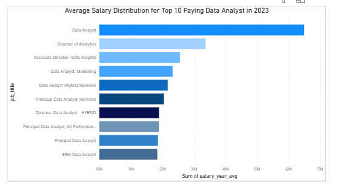
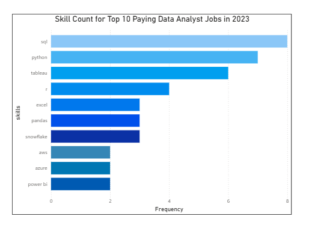

# Introduction

Memperdalam pasar kerja data! Berfokus pada peran analis data, proyek ini mengeksplorasi pekerjaan bergaji tinggi, keterampilan yang banyak dicari, dan di mana permintaan tinggi bertemu dengan gaji tinggi dalam analitik data.

# Background

Didorong oleh keinginan untuk menavigasi pasar kerja analis data secara lebih efektif, proyek ini lahir dari keinginan untuk menentukan keterampilan yang bergaji tinggi dan banyak dicari, serta menyederhanakan pekerjaan orang lain untuk menemukan pekerjaan yang optimal.

### Pertanyaan yang ingin saya jawab melalui SQL query saya adalah:

1. Apa saja pekerjaan analis data dengan gaji tertinggi?
2. Skills apa yang dibutuhkan untuk pekerjaan bergaji tinggi ini?
3. Skills apa yang paling dibutuhkan untuk analis data?
4. Skills apa yang terkait dengan gaji yang lebih tinggi?
5. Skills apa yang paling optimal untuk dipelajari?

# Tools I used

Untuk Memperdalam di dunia kerja analis data, saya memanfaatkan kekuatan beberapa tools utama:

- **SQL:** fondasi utama dalam proses analys ini, yang memungkinkan saya untuk melakukan kueri pada basis data dan menggali wawasan penting.
- **PostgreSQL:** Database Management System yang saya pilih, ideal untuk menangani data lowongan pekerjaan.
- **Visual Studio Code:** andalan saya untuk manajemen basis data dan mengeksekusi kueri SQL.
- **GIT & GitHub:**
  penting untuk control version dan berbagi skrip serta analisis SQL Queries saya, memastikan kolaborasi dan pelacakan proyek.
- **Power BI:** Visualisasi hasil Query agar mudah untuk dianalisa.

# The Analysis

Setiap pertanyaan untuk proyek ini mencakup aspek spesifik dari pasar kerja analis data. Berikut cara saya menjawab setiap pertanyaan:

### 1. Pekerjaan Analis Data dengan Gaji Tertinggi

Untuk mengidentifikasi peran dengan gaji tertinggi, saya memfilter posisi analis data berdasarkan gaji tahunan rata-rata dan lokasi, dengan fokus pada pekerjaan remote. Pertanyaan ini menyoroti peluang gaji tinggi di bidang ini.

```sql
SELECT job_id,
    job_title,
    job_location,
    job_schedule_type,
    salary_year_avg,
    job_posted_date,
    name AS company_name
FROM job_postings_fact
    LEFT JOIN company_dim ON job_postings_fact.company_id = company_dim.company_id
WHERE job_title_short = 'Data Analyst'
    AND job_location = 'Anywhere'
    AND salary_year_avg IS NOT NULL
ORDER BY salary_year_avg DESC
LIMIT 10;
```

Berikut rincian pekerjaan analis data teratas pada tahun 2023:

**Rentang Gaji yang Luas:** 10 gaji analis data teratas berkisar dari $184.000 hingga $1.650.000, menunjukkan potensi gaji yang signifikan di bidang ini.

**Perusahaan yang Beragam:** Perusahaan seperti SmartAsset, Meta, dan TAT&T termasuk di antara yang menawarkan gaji tinggi, menunjukkan minat yang luas di berbagai industri.

**Variasi Jabatan:** Terdapat keragaman yang tinggi dalam jabatan, dari Analis Data hingga Direktur Analisis, yang mencerminkan beragam peran dan spesialisasi dalam analisis data.



Grafik batang yang memvisualisasikan gaji untuk 10 analis data dengan gaji tertinggi.

### 2. Keterampilan untuk Pekerjaan Bergaji Tinggi

Untuk memahami keterampilan apa yang dibutuhkan untuk pekerjaan bergaji tinggi, saya menggabungkan skills_job_dim dengan skills_dim, yang memberikan nilai tambah bagi perusahaan untuk peran dengan kompensasi tinggi.

```sql
WITH top_paying_job AS (
    SELECT job_id,
        job_title,
        salary_year_avg,
        name AS company_name
    FROM job_postings_fact
        LEFT JOIN company_dim ON job_postings_fact.company_id = company_dim.company_id
    WHERE job_title_short = 'Data Analyst'
        AND job_location = 'Anywhere'
        AND salary_year_avg IS NOT NULL
    ORDER BY salary_year_avg DESC
    LIMIT 10
)
SELECT top_paying_job.*,
    skills
FROM top_paying_job
    INNER JOIN skills_job_dim ON top_paying_job.job_id = skills_job_dim.job_id
    INNER JOIN skills_dim ON skills_job_dim.skill_id = skills_dim.skill_id
ORDER BY salary_year_avg DESC
```

Berikut rincian keterampilan yang paling diminati untuk 10 pekerjaan analis data dengan gaji tertinggi pada tahun 2023:

**SQL** memimpin dengan angka 8 yang dicetak tebal.

**Python** menyusul dengan angka 7 yang dicetak tebal.

**Tableau** juga sangat dicari, dengan angka 6 yang dicetak tebal. Keterampilan lain seperti R, Snowflake, Pandas, dan Excel menunjukkan tingkat permintaan yang bervariasi.



Grafik batang yang memvisualisasikan jumlah keterampilan untuk 10 pekerjaan dengan bayaran tertinggi bagi analis data.

### 3. Keterampilan yang Paling Banyak Diminati untuk Analis Data

Query ini membantu mengidentifikasi keterampilan yang paling sering diminta dalam lowongan pekerjaan, mengarahkan fokus ke area dengan permintaan tinggi.

```sql
WITH top_paying_job AS (
    SELECT job_id,
        job_title,
        salary_year_avg,
        name AS company_name
    FROM job_postings_fact
        LEFT JOIN company_dim ON job_postings_fact.company_id = company_dim.company_id
    WHERE job_title_short = 'Data Analyst'
        AND job_location = 'Anywhere'
        AND salary_year_avg IS NOT NULL
    ORDER BY salary_year_avg DESC
    LIMIT 10
)
SELECT top_paying_job.*,
    skills
FROM top_paying_job
    INNER JOIN skills_job_dim ON top_paying_job.job_id = skills_job_dim.job_id
    INNER JOIN skills_dim ON skills_job_dim.skill_id = skills_dim.skill_id
ORDER BY salary_year_avg DESC

```

Berikut rincian keterampilan yang paling banyak diminta untuk analis data pada tahun 2023

**SQL** dan **Excel** tetap fundamental, menekankan perlunya keterampilan dasar yang kuat dalam pemrosesan data dan manipulasi spreadsheet.

**Tools Programming** dan **Visualisasi** seperti **Python**, **Tableau**, dan **Power BI** sangat penting, menunjukkan semakin pentingnya keterampilan teknis dalam story telling data dan dukungan keputusan.

| No  | Skills   | Demand Count |
| --- | -------- | ------------ |
| 1   | SQL      | 7,291        |
| 2   | Excel    | 4,611        |
| 3   | Python   | 4,330        |
| 4   | Tableau  | 3,745        |
| 5   | Power BI | 2,609        |

Tabel permintaan untuk 5 keterampilan teratas dalam lowongan pekerjaan analis data.

### 4. Keterampilan Berdasarkan Gaji

Penelusuran rata-rata gaji yang terkait dengan berbagai keterampilan mengungkapkan keterampilan mana yang bergaji tertinggi.

Berikut rincian hasil untuk keterampilan dengan gaji tertinggi bagi Analis Data:

- Permintaan Tinggi untuk Keterampilan Big Data & ML: Gaji tertinggi diraih oleh analis yang ahli dalam teknologi big data (PySpark, Couchbase), perangkat pembelajaran mesin (DataRobot, Jupyter), dan pustaka Python (Pandas, NumPy), yang mencerminkan tingginya valuasi industri terhadap kemampuan pemrosesan data dan pemodelan prediktif.

- Kemahiran Pengembangan & Penerapan Perangkat Lunak: Pengetahuan dalam perangkat pengembangan dan penerapan (Gitlab, Kubernetes, Airflow) menunjukkan potensi kolaborasi yang menguntungkan antara analisis data dan rekayasa, dengan premi pada keterampilan yang memfasilitasi otomatisasi dan manajemen alur data yang efisien.

- Keahlian Komputasi Awan: Keakraban dengan perangkat cloud dan rekayasa data (Elasticsearch, Databricks, GCP) menggarisbawahi semakin pentingnya lingkungan analitik berbasis cloud, yang menunjukkan bahwa kemahiran cloud secara signifikan meningkatkan potensi penghasilan dalam analitik data.

### 5. Keterampilan Paling Optimal untuk Dipelajari

Menggabungkan wawasan dari data permintaan dan gaji, query ini bertujuan untuk mengidentifikasi keterampilan yang sangat diminati dan memiliki gaji tinggi, menawarkan fokus strategis untuk pengembangan keterampilan.

| No  | Skill ID | Skill      | Demand Count | Avg Salary ($) |
| --- | -------- | ---------- | ------------ | -------------- |
| 1   | 8        | go         | 27           | 115,320        |
| 2   | 234      | confluence | 11           | 114,210        |
| 3   | 97       | hadoop     | 22           | 113,193        |
| 4   | 80       | snowflake  | 37           | 112,948        |
| 5   | 74       | azure      | 34           | 111,225        |
| 6   | 77       | bigquery   | 13           | 109,654        |
| 7   | 76       | aws        | 32           | 108,317        |
| 8   | 4        | java       | 17           | 106,906        |
| 9   | 194      | ssis       | 12           | 106,683        |
| 10  | 233      | jira       | 20           | 104,918        |
| 11  | 79       | oracle     | 37           | 104,534        |
| 12  | 185      | looker     | 49           | 103,795        |
| 13  | 2        | nosql      | 13           | 101,414        |
| 14  | 1        | python     | 236          | 101,397        |
| 15  | 5        | r          | 148          | 100,499        |
| 16  | 78       | redshift   | 16           | 99,936         |
| 17  | 187      | qlik       | 13           | 99,631         |
| 18  | 182      | tableau    | 230          | 99,288         |
| 19  | 197      | ssrs       | 14           | 99,171         |
| 20  | 92       | spark      | 13           | 99,077         |
| 21  | 13       | c++        | 11           | 98,958         |
| 22  | 186      | sas        | 63           | 98,902         |
| 23  | 7        | sas        | 63           | 98,902         |
| 24  | 61       | sql server | 35           | 97,786         |
| 25  | 9        | javascript | 20           | 97,587         |

Berikut rincian keterampilan paling optimal untuk Analis Data di tahun 2023:

- Bahasa Pemrograman yang Banyak Diminati: Python dan R menonjol karena permintaannya yang tinggi, dengan jumlah permintaan masing-masing 236 dan 148. Meskipun permintaannya tinggi, gaji rata-rata mereka sekitar $101.397 untuk Python dan $100.499 untuk R, yang menunjukkan bahwa kemahiran dalam bahasa-bahasa ini sangat dihargai tetapi juga tersedia secara luas.

- Cloud Tools and Technologies : Keterampilan dalam teknologi khusus seperti Snowflake, Azure, AWS, dan BigQuery menunjukkan permintaan yang signifikan dengan gaji rata-rata yang relatif tinggi, menunjukkan semakin pentingnya platform cloud dan teknologi big data dalam analisis data.

- Business Inteligence and Visualitation: Tableau dan Looker, dengan jumlah permintaan masing-masing 230 dan 49, dan gaji rata-rata sekitar $99.288 dan $183.795, menyoroti peran penting visualisasi data dan kecerdasan bisnis dalam menghasilkan wawasan yang dapat ditindaklanjuti dari data.

- Database Technologies: Permintaan akan keterampilan dalam basis data tradisional dan NoSQL (Oracle, SQL Server, NoSQL) dengan gaji rata-rata berkisar antara $97.786 hingga $104.534, mencerminkan kebutuhan yang terus berlanjut akan keahlian dalam penyimpanan, pengambilan, dan pengelolaan data.

# What I learned

Sepanjang journey data ini, saya telah meningkatkan SQL Toolkit saya dengan beberapa kekuatan yang luar biasa:

- **Pembuatan Query Kompleks:** SQL tingkat lanjut, menggabungkan tabel layaknya seorang profesional dan menggunakan klausa WITH untuk manuver tabel sementara ninja-level.

- **Agregasi Data:** Merasa nyaman dengan GROUP BY dan menjadikan fungsi agregat seperti COUNT() dan AVG() sebagai asisten saya dalam meringkas data.

- **Sihir Analitis:** Meningkatkan keterampilan memecahkan teka-teki di dunia nyata, mengubah pertanyaan menjadi query SQL yang dapat ditindaklanjuti dan berwawasan.

# Conclusions

### Insights

Dari analisis tersebut, diperoleh beberapa wawasan umum:

1. **Pekerjaan Analis Data Bergaji Tinggi:** Pekerjaan dengan gaji tertinggi untuk analis data yang memungkinkan kerja jarak jauh menawarkan beragam gaji, dengan gaji tertinggi sebesar $650.0001

2. **Skills untuk Pekerjaan Bergaji Tinggi:** Pekerjaan analis data bergaji tinggi membutuhkan keahlian tingkat lanjut, yang menunjukkan bahwa ini merupakan keterampilan penting untuk mendapatkan gaji tinggi.

3. **Skills yang Paling Banyak Diminati:** SQL juga merupakan keterampilan yang paling banyak dicari di pasar kerja analis data, sehingga menjadikannya penting bagi para pencari kerja.

4. **Skills dengan Gaji Lebih Tinggi:** Keterampilan khusus, seperti SVN dan Solidity, dikaitkan dengan gaji rata-rata tertinggi, yang menunjukkan adanya premi pada keahlian khusus.

5. **Skills Optimal untuk Nilai Pasar Kerja:** SOL Leads dalam demand dan menawarkan gaji rata-rata yang tinggi, memposisikannya sebagai salah satu keterampilan paling optimal bagi analis data untuk belajar memaksimalkan nilai pasar mereka.
